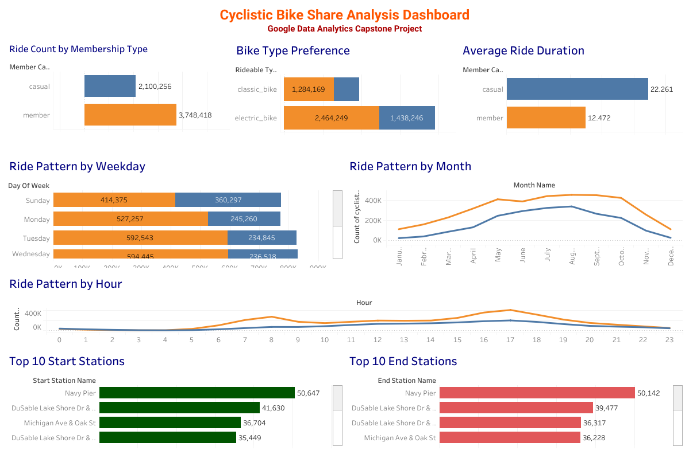

# 🚴 Cyclistic Bike Share Analysis

### Google Data Analytics Professional Certificate Capstone Project

This repository contains an end-to-end data analytics project completed as part of the Google Data Analytics Professional Certificate. The project analyzes one year of Cyclistic (Divvy) bike-share trip data using Python and Tableau to understand the behavioral differences between annual members and casual riders and provide data-driven business recommendations.

---

## 📌 Project Overview

Cyclistic is a fictional bike-share company based in Chicago. The company's marketing team aims to increase the number of annual memberships because annual members are more profitable than casual riders.

This project analyzes one year of historical bike-share trip data to identify riding patterns, compare rider behavior, and generate actionable business recommendations that support data-driven decision-making.

---

## 🎯 Business Task

**How do annual members and casual riders use Cyclistic bikes differently, and how can Cyclistic encourage more casual riders to become annual members?**

---

## 📊 Dashboard Preview



---

## 🛠️ Tools & Technologies

* Python
* Pandas
* NumPy
* Jupyter Notebook
* Tableau Public
* Microsoft Excel

---

## 📂 Dataset

* **Dataset:** Divvy / Cyclistic Historical Trip Data
* **Analysis Period:** June 2025 – May 2026

The original dataset is not included in this repository due to its large size.

**Official Dataset**

https://divvy-tripdata.s3.amazonaws.com/

---

## 🧹 Data Preparation

The following data cleaning and preparation steps were completed:

* Merged 12 monthly datasets into a single dataset
* Removed duplicate records
* Handled missing values
* Converted date and time columns to the appropriate format
* Created new analytical features:

  * Ride Duration
  * Month
  * Day of Week
  * Hour
* Removed invalid ride durations
* Exported the cleaned dataset for visualization in Tableau

---

## 📈 Exploratory Data Analysis

The analysis includes the following visualizations:

* Ride Count by Member Type
* Bike Type Preference
* Average Ride Duration
* Ride Pattern by Weekday
* Ride Pattern by Month
* Ride Pattern by Hour
* Top 10 Start Stations
* Top 10 End Stations

---

## 📊 Interactive Tableau Dashboard

Explore the interactive dashboard here:

https://public.tableau.com/app/profile/sabbir.ahmed3169/viz/dashboardcyclistic22/CyclisticDashboard1

---

## 💡 Key Insights

* Annual members completed significantly more rides than casual riders.
* Casual riders recorded longer average ride durations.
* Riding demand changed noticeably across weekdays, months, and hours.
* Electric bikes were popular among both rider groups.
* Several stations consistently ranked among the busiest start and end locations.

---

## 📢 Business Recommendations

* Launch targeted marketing campaigns during peak riding seasons.
* Promote annual membership benefits to frequent casual riders.
* Offer seasonal membership discounts and limited-time promotions.
* Focus marketing activities around high-demand stations.
* Introduce loyalty programs to encourage membership conversion.

---

## 📁 Repository Structure

```text
Dashboard/
│── dashboard cyclistic 22.twb
│── dashboard.png
│── dashboard_preview.png

Image/
│── 1. Ride count by member casual.png
│── 2. Bike type preference.png
│── 3. Avg ride duration.png
│── 4. Ride patern by week.png
│── 5. Ride pattern by month.png
│── 6. Ride pattern by hour.png
│── 7. top 10 start station.png
│── 8. top 10 end station.png

NoteBook/
│── Cyclistic_Capstone.ipynb

README.md
```

---

## 👨‍💻 Author

**Sabbir Ahmed**

**GitHub:** https://github.com/sabbir9994

**Tableau Public Dashboard:**
https://public.tableau.com/app/profile/sabbir.ahmed3169/viz/dashboardcyclistic22/CyclisticDashboard1

---

## 🙏 Acknowledgements

This project was completed as part of the Google Data Analytics Professional Certificate and is intended for educational and portfolio purposes.
